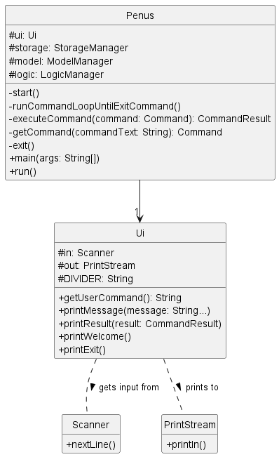
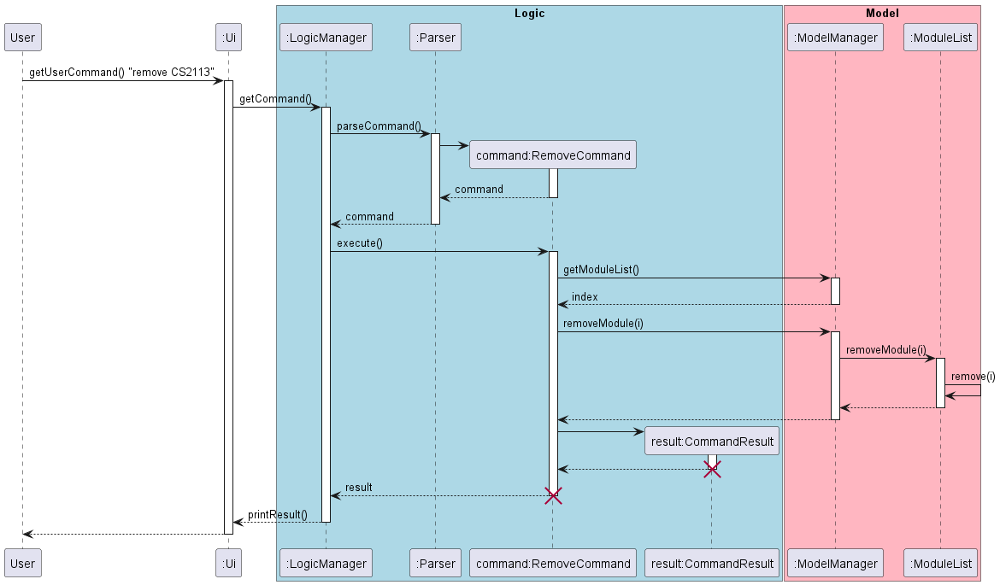
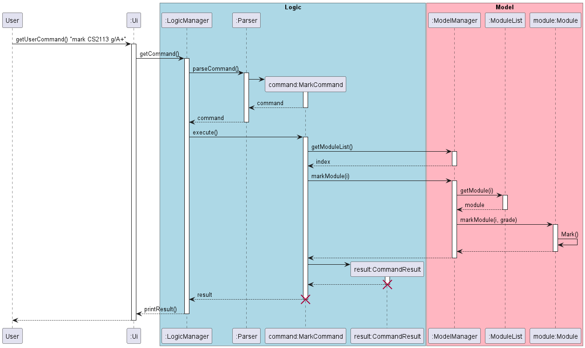
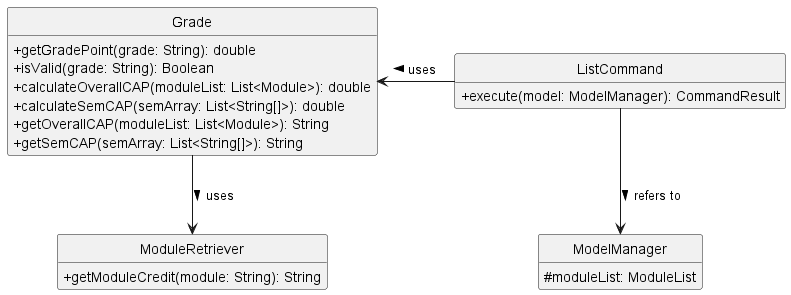

# Developer Guide
<!----------------------------Table of Contents----------------------------------------->
- [Acknowledgements](#acknowledgements)
- [Design](#design)
  - [Architecture](#architecture)
  - [UI Component](#ui-component)
  - [Logic Component](#logic-component)
  - [Model Component](#model-component)
  - [Storage Component](#storage-component)
  - [Common classes](#common-classes)
- [Implementation](#implementation)
  - [Add Module](#add-module)
  - [Remove Module](#remove-module)
  - [Mark Module As Taken](#mark-module-as-taken)
  - [List Modules](#list-modules)
  - [Display Status](#display-status)
  - [Get Module Details](#get-module-details)
  - [Initialise User](#initialise-user)
  - [Save To Local Drive](#save-plan-to-local-drive)
- [Documentation, logging, testing, configuration, dev-ops](#documentation-logging-testing-configuration-dev-ops)
  - [Documentation](#documentation)
  - [Logging](#logging)
  - [Testing](#testing)
  - [Configuration](#configuration)
  - [Dev-ops](#dev-ops)
- [Appendix A: Requirements](#appendix-a--requirements)
- [Appendix B: Instructions for manual testing](#appendix-b--instructions-for-manual-testing)
<!----------------------------Acknowledgements----------------------------------------->
## Acknowledgements
References made from [AddressBook 2](https://github.com/se-edu/addressbook-level2) and [AddressBook 3](https://github.com/se-edu/addressbook-level3).


<!----------------------------Design----------------------------------------->
## Design

### Architecture


### UI Component


### Logic Component


### Model Component


### Storage Component

### Common classes
Classes used by multiple components are in the `seedu.penus.commons` package.

<!----------------------------Implementation----------------------------------------->
## Implementation
### Add module
The Add Module feature allows users to add two types of modules (taken or planning) to the ModuleList using the commands `plan` or `taken`. The two types of modules are differentiated by its `Module()` overloaded constructor, accepting different type signatures. It is facilitated by `LogicManager` and extends the abstract class `Command`.

Given below is an example usage scenario of the 2 types of modules and how the add module mechanism behaves at each step.

**When a planned module is added:**
Step 1. The user launches the application for the first time. The ModuleList will be initialised with the initial module list state if provided in `penus.txt`.

Step 2. The user executes the `plan CS2113 y/1 s/2` command to plan the module CS2113 for year 1 and semester 2 to be added into the list. The `plan` command is parsed through `Parser` which returns a `PlanCommand()` object if a valid command is provided. The `PlanCommand()` constructs a `Module()` object with the overloaded constructor `Module()`. It is instantiated with the respective arguments which sets the `isTaken` parameter `false`, `moduleCode`, `year` and `semester`.

Step 3. This is then executed by the `LogicManager` calling `execute()` and passes it to the `ModelManager` through the `addModule()` method. In `ModelManager`, the `Module()` object is passed to the `ModuleList()` where the module is added to the list.

Step 4. Upon successful execution of all of the above, it is then passed back to `PlanCommand` where  `CommandResult()` is constructed with the message to be printed to the user.

Step 5. The `CommandResult` object is passed to the `Ui` component with a `printMessage()` method which prints the formatted message to the Command Line Interface.

The following sequence diagram shows how the `plan` command works:


**Similarly, for when a taken module is added:**
Step 1. The user launches the application for the first time. The ModuleList will be initialised with the initial module list state if provided in `penus.txt`.

Step 2. The user executes the `taken CS2113 y/1 s/2 g/A+` command to plan the module CS2113 for year 1 and semester 2 to be added into the list. The `taken` command is parsed through `Parser` which returns a `TakenCommand()` object if a valid command is provided. The `PlanCommand()` constructs a `Module()` object with the overloaded constructor `Module()`. It is instantiated with the respective arguments which sets the `isTaken` parameter `true`, `moduleCode`, `year`, `semester` and `grade`.

Step 3 - 6. Identical to that of a `plan` command as mentioned above.

_Design considerations:_
**Aspect: How plan/taken executes:**
- **Alternative 1 (current choice):** Have an overloaded Module() constructor which accepts both types of modules. The difference being the isTaken parameter.
  - Pros: Easy to implement
  - Cons: Less readability and harder to differentiate the two.
- **Alternative 2:** Have two classes, TakenModule and PlanModule, for the 2 types.
  - Pros: More readability and easier differentiation.
  - Cons: More complex. 2 classes inherited + checking the class type in queries

<br>

### Remove module
The Remove Module feature allows users to remove a module from the ModuleList using the command `remove`. It is facilitated by `LogicManager` and extends the abstract class `Command`. The module code is given as the argument to remove that specific module.

Given below is an example scenario of the remove command and how it behaves at each step.

Step 1. The user executes the `remove CS2113` command, given that a module `CS2113` exists within the `ModuleList`, to remove the module. The `remove` command is parsed through `Parser` which returns a `RemoveCommand()` object if a valid command is provided. The `RemoveCommand()` stores the string `moduleCode` as its attribute.

Step 2. The `RemoveCommand` is then executed by the `LogicManager` calling `execute()`. Then, the `ModuleList`, which is retrieved from the `ModelManager` through `getModuleList()`, is iterated through to find the index of a `Module` with the same corresponding `moduleCode` through `getModule().getCode()`. This index is assigned to a variable.

Step 3. It is then passed to the `ModelManager`, along with the index, and executes the `removeModule()` method on the `ModuleList` object. The `ModuleList` subsequently executes the `remove(index)` method to remove the module from the list.

Step 4. Upon successful execution of the above, it is then passed back to `RemoveCommand` where  `CommandResult()` is constructed with the message to be printed to the user.

Step 5. The `CommandResult` object is passed to the `Ui` component with a `printMessage()` method which prints the formatted message to the Command Line Interface.

The following sequence diagram shows how the `remove` command works:


<br>

### Mark module as taken
The Mark Module feature allows user to mark a plan module as a taken module, adding the grade using the command `mark`. It is facilitated by `LogicManager` and extends the abstract class `Command`. The module code and grade is given as the argument to convert that specific planned module to a taken module and add a grade.

Given below is an example scenario of the mark command and how it behaves at each step.

Step 1. The user executes the `mark CS2113 g/A+` command, given that a plan module `CS2113` exists within the `ModuleList`, to mark the module. The `mark` command is parsed through `Parser` which returns a `MarkCommand()` object if a valid command is provided. The `MarkCommand()` stores the string `moduleCode` and `grade` as its attributes.

Step 2. The `MarkCommand` is then executed by the `LogicManager` calling `execute()`. Then, the  `ModuleList`, which is retrieved from the `ModelManager` through `getModuleList()`, is iterated through to find the index of a `Module` with the same corresponding `moduleCode` through `getModule().getCode()`. This index is assigned to a variable.

Step 3. It is then passed to the `ModelManager`, along with the index and grade, and executes the `markModule()` method. It retrieves the `Module` object from the `ModuleList` through the `getModule(index)` method. The `markTaken()` method is then called on this `Module` which sets the `isTaken` attribute as true and saves the grade. 

Step 4. Upon successful execution of the above, it is then passed back to `MarkCommand` where  `CommandResult()` is constructed with the message to be printed to the user.

Step 5. The `CommandResult` object is passed to the `Ui` component with a `printMessage()` method which prints the formatted message to the Command Line Interface.

The following sequence diagram shows how the `mark` command works:


<br>

### List modules
The List modules feature allows users to view their added modules, in a specified range using the command `list`. There are 3 ways of modules listing :
  1. List all modules in the planner
  2. List all modules in the planner for a specific year
  3. List all modules in the planner for a specific year and semester

Given below is an example usage scenario for each type, and how the list modules mechanism behaves at each step.
**When a the year and semester are not specified:**
Step 1. The user executes the command `list`, without any specified year or semester range, to list all modules in the planner. The `list` command is executed within the switch case of the `parseCommand()` method of `CommandParser`. 

Step 2. If a valid command is entered, the `printModule` method of `ModuleList` will be executed with the inputs of -1 for both the year and semester. 

Step 3. In `printModule` of `ModuleList`, a `Map<Integer, Map<Integer, List<String[]>>>` Hashmap is iniitialised, and all the modules stored in the `modules` container is added to the Hashmap. 

Step 4. The year and semester have values of -1, which then `printModules` recognises as printing all modules in the Hashmap. A `List<String[]> modules` is initialised with all the modules in the Hashmap. 

Step 5. If `modules` is not empty, the modules for that year and semester are printed sequentially. For modules with available grade information, the grade will be printed beside the module code. 

**When a the year is specified:**
Step 1. The user executes the command `list y/1`, with the year specified, but not the semester, to print the modules for both semesters in Year 1. The `list` command is executed within the switch case of the `parseCommand()` method of `CommandParser`. 

Step 2. If a valid command is entered, the `printModule` method of `ModuleList` will be executed. The string `inputArray` is then split into parts separated by the flags `y/` and `s/` into a `rangeToPrint` array. 

Step 3. If the year entered is valid, the integer `yearSpecified` is assigned parsed from the String that the user entered. The integer `semesterSpecified` is assigned to 0. The `printModule` method of `ModuleList` is called with the `yearSpecified` and `semesterSpecified` as inputs, and `semesterSpecified` is valued at -1.

Step 3. In `printModule` of `ModuleList`, a `Map<Integer, Map<Integer, List<String[]>>>` Hashmap is iniitialised, and all the modules stored in the `modules` container is added to the Hashmap. 

Step 4. A `List<String[]> modules` is initialised with all the modules in the Hashmap. 

Step 5. If `modules` is not empty, the modules for that year and both its semesters are printed sequentially. For modules with available grade information, the grade will be printed beside the module code. 

**When a the year and semester are specified:**
Step 1. The user executes the command `list y/1 s/2`, with the year and semester specified, to print the modules for Year 1 Semester 2. The `list` command is executed within the switch case of the `parseCommand()` method of `CommandParser`. 

Step 2. If a valid command is entered, the `printModule` method of `ModuleList` will be executed. The string `inputArray` is then split into parts separated by the flags `y/` and `s/` into a `rangeToPrint` array. 

Step 3. If the year entered is valid, the integer `yearSpecified` and `semesterSpecified` is parsed from the String that the user entered. The `printModule` method of `ModuleList` is called with the `yearSpecified` and `semesterSpecified` as inputs.

Step 3. In `printModule` of `ModuleList`, a `Map<Integer, Map<Integer, List<String[]>>>` Hashmap is iniitialised, and all the modules stored in the `modules` container is added to the Hashmap. 

Step 4. A `List<String[]> modules` is initialised with all the modules in the Hashmap. 

Step 5. If `modules` is not empty, the modules for that specified year and semester are printed sequentially. For modules with available grade information, the grade will be printed beside the module code. 

<br>

### Display status
The Display Status feature `status` lists all the core modules in the user's course, and indicates which ones the user has or has
not taken. The feature also displays the total number of MCs the user has taken.

Given below is an example of how `status` is called at each step.

Step 1: The user types in `status`, which will be taken in by the `getUserCommand()` method of the `Ui` class. The input command
will then be passed to the `LogicManager` class by `getCommand()` and calls `parseCommand()` which returns the main command, `StatusCommand`. 
The `LogicManager` then calls `execute()` on `StatusCommand`, which runs the main logic behind this command.

Step 2: When `execute()` is first called, the methods calls `getTakenCoreModsList()`. `getTakenCoreModsList()` first calls the `ModelManager`'s `getCoreModsList()`  which returns a hashmap with the course as the key and list of string of core module codes. In order to get
the core module codes of the user's course, the user's course is retrieved from by `ModelManager`'s `getUserCourse()`, at which the
attribute `course` is given by the user on initialization. An exception is thus triggered if the user calls `status()`
without initialising. By giving the key as the user's course, the list of core modules is retrieved. The list of core modules is then compared against 
the user's `ModuleList`, retrieved by `ModelManager`'s `getModuleList()` and taken core module codes will be added into `takenCoreMods` list. Lastly, it calls
`getTakenGESS()`, `getTakenGEC()` and `getTakenGEN()` to check for the status of GE modules and adds their codes into `takenCoreMods` if taken. `takenCoreMods` is then returned.

Step 3: `getUntakenCoreModsList()` is called, which undergoes a same process  as `getTakenCoreModsList()` but with untaken core modules codes added into `untakenCoreMods` list.

Step 4: Each module code in `takenCoreMods` list and `untakenCoreMods` list is then passed into a method `moduleDetailsString()`, which returns 
in the format of "`moduleCode` `moduleTitle` Mcs: `moduleMCs`" and added into the `message` string, formatted using `Stringbuilder`.
The `moduleTitle` and `moduleMCs` of each module is retrieved by calling static methods `getModuleCredit2223()` and `getTitle2223()` of util's `ModuleRetriever` class.

Step 5: The static method `numberOfMcs()` is called, which retrieves each module's MC through the `Module Retriever`'s `getModuleCredit2223()`
 and adds them together, returning the `numberOfMCs` taken by the user. The `numberOfMcs` is added into the message, with "/160" concatenated behind.

Step 6: The message is then passed to the `LogicManager` as a `CommandResult`. The `LogicalManager` then calls for `UI`'s `printResult()` to display the status message to
the user. 

The following sequence diagram shows how the `status` command works:


<br>

### Get module details
The details feature is facilitated by `ModuleRetriever`. It retrieves the module’s title, description, pre-requisites, modular credits, and if the module is SU-able. Additionally, it implements the following operations:
`retrieveTitle()` - Retrieves the module’s Title.
- `retrieveDescription()` - Retrieves the module’s Description.
- `retrievePrerequisite()` - Retrieves the module’s Pre-Requisites.
- `retrieveModuleCredits()` - Retrieves the module’s total Modular Credits.
- `retrieveSUstatus()` - Retrieves if the module can be SU-ed.

These operations are exposed in the `ModuleRetriever` class as `retrieveTitle()`, `retrieveDescription()`, `retrievePrerequisite()`, `retrieveModuleCredits()` and `retrieveSUstatus()` respectively. 

**Step 1:** The user launches the application for the first time. The API will not be called.

**Step 2:** The user executes `details cs2113` command to retrieve the details about CS2113 module. The details command calls `printDetails(moduleCode)`, passing the module code as the parameter.

**Step 3:** The `printDetails` method calls a few methods – `retrieveTitle(module)`, `retrieveDescription(module)`, `retrievePrerequisite(module)`, `retrieveModuleCredit(module)`, and `retrieveSUstatus(module)`. 
Each of these methods (e.g. `retrieveTitle(module)`) will make call the `getData()` method, passing the module code as the parameter.

  **Step 3a.** The `getData()` method will create a `HttpURLConnection` to NUS API MODS website, redirecting to the particular module’s data. It will then create a “GET” request, and parse the JSON in the API into a `JSONObject` and `JSONArray`. 
  The retrieved information will be stored as `moduleInfo` `JSONObject` in the `ModuleRetriever` class.

- _Note:_ If a “GET” request fails, it will stop the Connection, and return the HTTP Response Code.

- _Note:_ (Proposed) If an incorrect module was entered, the program will return an error, and ask the user to input the correct module code.

**Step 3b.** Each retrieve method (e.g. `retrieveTitle()`) will retrieve the respective information from the retrieved `JSONObject`, and return it as a `String`.

**Step 4:** The `printDetails()` method will then store each retrieved information in a `String`, and format them for display standards. It will then store each separated `String` into a `messagePacket` array, and pass it into the `Ui.printMessage()` function to be printed in the CLI.

The following sequence diagram shows how the mechanism works:

_Design considerations:_

**Aspect: How detail executes:**
- **Alternative 1 (current choice):** Retrieves module details from the NUS API.
  - Pros: Access to all the modules’ information
  - Cons: Not usable when the device is offline.
- **Alternative 2:** Store all the module details on an offline .txt file, then retrieve it from there.
  - Pros: Can be used offline.
  - Cons: It is a tedious task to store all the modules’ details on a .txt file, and the file size will be very big.


<br>

### Initialise user
(TBA)

<br>

### Calculate CAP
The CAP calculator feature is facilitated by `Grade`. It calculates the User's
CAP by Semester and by Overall for all `taken` modules.
This is implemented by the following methods:
`calculateSemCAP()`
,`calculateOverallCAP()`
,`getSemCAP()`
,`getOverallCAP()`.  


Below is the sequence of steps which utilises the CAP mechanism:

Step 1: 
You already initialised yourself as a new user.
The user adds 3 module as taken `CG2023 y/1 s/2 g/A+` and `CG2111A y/1 s/2 g/B+` 
and `CG1111A y/1 s/1 g/A+`. 

Step 2:
User enters a list command which comprises all three ways of module listing as stated in 
the List Modules feature. `ListCommand` refers to `ModelManager` to obtain the list of 
modules planned or taken by the User. This is facilitated by `getModuleListObj()` method
under `ModelManager` class.

Step 3: 
As such, when the `execute` method under `ListCommand` is called, it obtains the parameter
provided by `ModelManager`. The methods `getSemCAP()` and `getOverallCAP()` is executed to calculate CAP by Overall and by Semester from all modules. the CAP which is returned as a String is added into 
a messageArray for printing to Command Line Interface.


The following is the Class Diagram describing when the CAP calculator is used.

Class Diagram (with unnecessary details ommitted):


<br>

### Save planner to local drive
The Save to local drive feature allows user to save the `ModuleList` and `User` details to a `penus.txt` file. It is facilitated by FileStorage and is executed after the `execute()` of a command by `LogicManager`. 

Given below is an example of how the saving mechanism behaves at each step.

Step 1. The application is started for the first time which creates a `/data` directory and an empty text file `penus.txt` in that directory for file saving. The user inputs a valid command and is successfully executed, returning a `CommandResult` to `LogicManager`. When this is returned, the `StorageManager` executes the method `saveStorage()` acccepting the `ModuleList` and `User` objects as its arguments.

Step 2. In `StorageManager` the `saveStorage()` method calls the `save()` method and passes the `ModuleList` and `User` objects to the `FileStorage`. 

Step 3. A `FileWriter` object is instantiated with the filepath `/data/penus.txt` and writes to the text file. If the `User` object has valid attributes of `name` and `course`, the first line written would be the User's name and course in the format "User ### <USERNAME> ### <COURSE>". 

_Example:_
```
User ### Albert ### Computer Engineering
```
Step 4. The next few lines of the file would then be written with the modules in the `ModuleList`. The list is iterated through and the `FileWriter` writes an encoded format of the module to the file with the `encode()` method of a `Module`. The `encode()` method formats the attributes of a `Module` into the format of : "<STATUS> ### <MODULECODE> ### <YEAR> ### <SEMESTER> (### <GRADE> if module is `Taken`)

_Example:_
```
Taken ### CS2113 ### 2 ### 1 ### A+
Plan ### CS2105 ### 3 ### 1
```

Step 5. The `FileWriter` is closed and the command flow continues as usual. 

The next time a user starts the program with a saved `penus.txt`:

Step 6. Upon starting the program, the `start()` method of `Penus` is executed where the `StorageManager` would execute `loadStorage()` and `loadUser()` respectively into the `ModelManager` constructor. These methods call the `retrieveMods()` and `retrieveUser()` methods of the `FileStorage` respectively.

Step 7a. In `retrieveMods()`, a `Scanner` and a `ArrayList` is instantiated. It takes in the lines of the `penus.txt` file which does not contain the keyword `User` and decodes it with `decodeModule()` method to return a `Module`. This `Module` is then added to the list. This process loops until there is no next line (aka the end of the file). This `ArrayList` is then passed back to the `ModelManager` constructor.

Step 7b. In `retrieveUser()`, a `Scanner` and a `User` object is instantiated. The `Scanner` takes in the first line of the `penus.txt` file. If the keyword `User` is found, the line is decoded and sets the attribute `name` and `course` of the `User` object. This `User` is then passed back to the `ModelManager` constructor.

Step 8. The `ModelManager` constructs the `ModuleList` and `User` object with the received objects respectively from the `StorageManager`. The user's saved state can then be continued on.

Below is a class diagram of the classes pertaining to the save feature (some details omitted for simplicity):


<!----------------------------Documentation----------------------------------------->
## Documentation, logging, testing, configuration, dev-ops
### Documentation
### Logging
### Testing
### Configuration
### Dev-ops

<!----------------------------Appendix A----------------------------------------->
## Appendix A: Requirements
### Product scope

#### Target user profile
- NUS engineering students
- prefers desktop CLI over other available planner application(s)
- prefers typing to mouse interactions

#### Value proposition
Manage a planner faster and more efficiently than a typical mouse/GUI driven application

### User Stories
Priorities: High (must have) - `* * *`, Medium (nice to have) - `* *`, Low (unlikely to have) - `*`

| Priority | Version |         As a ...         | I want to ...                          | So that I can ...                                                   |
|:--------:|:-------:|:------------------------:|:---------------------------------------|:--------------------------------------------------------------------|
|   ***    |  v1.0   |         student          | add modules to the planner             | keep track of my planned and taken modules for my study term        |
|   ***    |  v1.0   |         student          | remove modules                         | remove modules that I have accidentally added                       |
|   ***    |  v1.0   |         student          | list all the modules in my planner     | see all modules I am planning for and have taken for the study term |
|   ***    |  v1.0   |         student          | mark a planned module as taken         | update my planner accordingly                                       |
|   ***    |  v1.0   | penultimate year student | display graduation status              | graduate on time                                                    |
|    **    |  v2.0   |         student          | see realtime module details            | understand module details without referring to other websites       |
|    **    |  v2.0   |         student          | check whether I meet the prerequisites | plan my timetable with less worries                                 |
|   ***    |  v2.0   |         student          | keep track of my CAP                   | I do not need to calculate my CAP after every semester              |
|   ***    |  v2.0   |         new user         | see usage instructions                 | refer to them in case I forget the application commands             |
|    **    |  v2.0   |      returning user      | save my planner                        | I do not need to re-add my modules                                  |
|   ***    |  v2.0   |         new user         | include my course                      | plan for course-specific core modules                               |


### Use cases

### Non-Functional Requirements
- PENUS should work on any mainstream OS as long as it has Java 11 or above installed.
- PENUS should be able to hold up to 1000 modules without a noticeable sluggishness in performance for typical usage.
- A user with above average typing speed for regular English text (i.e. not code, not system admin commands) should be able to accomplish most of the tasks faster using commands than using the mouse.

### Glossary

* *Mainstream OS* - Windows, Linux, Unix, OS-X
* *CLI* - Command Line Interface


<!----------------------------Appendix B----------------------------------------->
##  Appendix B: Instructions for manual testing
Given below are instructions to test the app manually.
> Note: These instructions only provide a starting point for testers to work on;
> testers are expected to do more *exploratory* testing. 