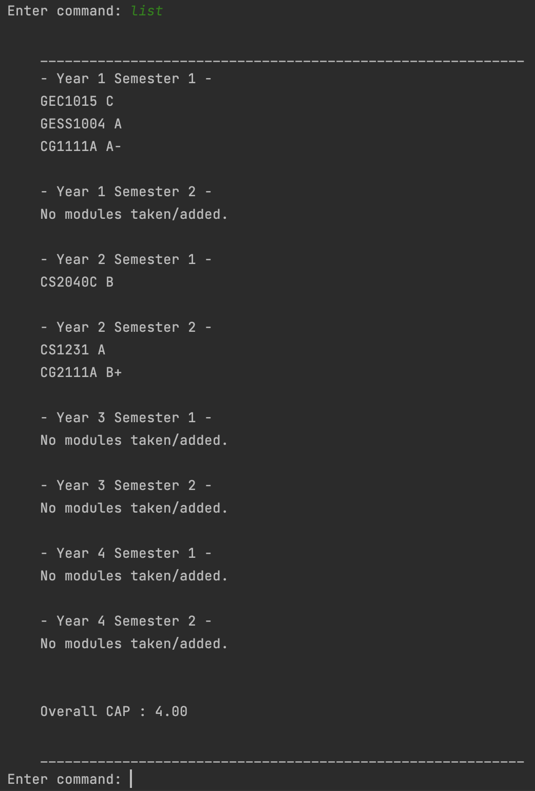
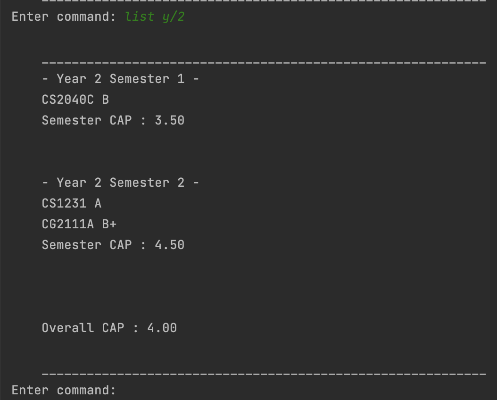
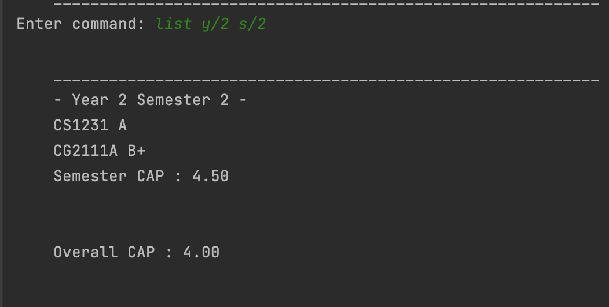
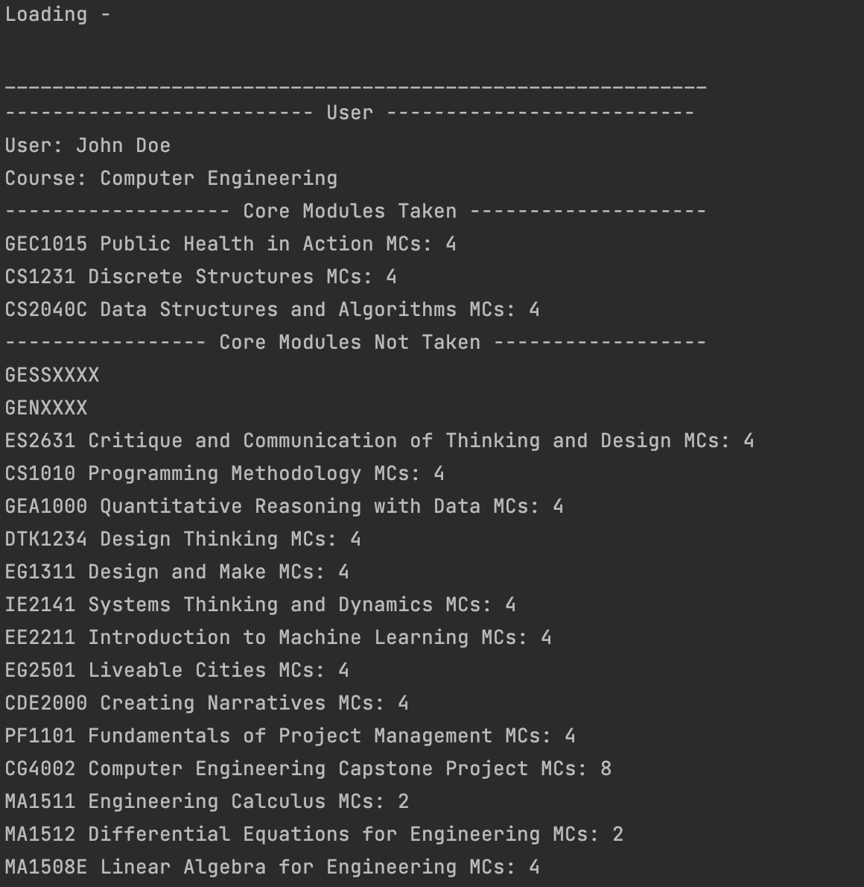

# 📜 PENUS User Guide

<pre>
 ___  _____        ______    ___  ___     ___   _________
/   \/      \     /      \  /   \/   \   /   \ /         \ 
|      __    \    |       \/    ||   |  |     ||    _     |
|     |__|    |   |        |    ||   |  |     ||     \    |
\            /    |    |   |    ||   |  |     |\      \_ /
/        ___/___  |    |   |    ||   |  |     | \_      \
|       | /     \ |    |   |    ||   |  |     |/  \      \
|_______|/   <> _\|    |   |    ||   \__/     ||   \_     |
\       /|   \____|    /\       |\            /|          |
 \__|__/  \______/\___/  \_____/  \__________/  \_________/
</pre>

## Introduction

**Planning Engineering with NUS (PENUS)** is a desktop app for managing and planning your modules in your university life!
Users are able to add modules that they have taken, plan for future modules and access useful features such as checking their graduation criteria and calculating their CAP. By using NUSmods API, users can retrieve important module details with a stroke of the keyboard.
It is optimised for use via a Command Line Interface (CLI).
For students that can type fast, PENUS can help them plan and track their modules for all four years of their time in university more efficiently.

## Table of Contents 📔
- [Quick Start](#quick-start-⚙️)
- [Features](#features-👾)
    + [Initialisation: `init`](#initialisation-init)
    + [Help: `help`](#help-help)
    + [Add taken modules: `taken`](#add-taken-modules-taken)
    + [Plan untaken modules: `plan`](#plan-untaken-modules-plan)
    + [Remove a module: `remove`](#remove-a-module-remove)
    + [Mark module as taken: `mark`](#mark-module-as-taken-mark)
    + [View modules: `list`](#view-modules-list)
    + [View graduation status: `status`](#view-graduation-status-status)
    + [View module details: `details`](#view-module-details-details)
    + [Clear modules: `clear`](#clear-modules-clear)
    + [Exit: `exit`](#exit-the-program-exit)
    + [Saving the data](#saving-the-data)
    + [Editing the data file](#editing-the-data-file)
- [FAQ](#faq-💻)
- [Command Summary](#command-summary-🔑)

## Quick Start ⚙️

{Give steps to get started quickly}

1. Ensure that you have Java 11 or above installed.
2. Download the latest version of PENUS from [here](https://github.com/AY2223S2-CS2113-T11-2/tp/releases/download/v2.0/penus.jar).
3. Copy the file to the folder you want to use as the home folder for your PENUS.
4. Open a command terminal, cd into the folder you put the jar file in, and use the `java -jar penus.jar` command to run the application.
5. Type the command in the Command Line Interface and press Enter to execute it.
_Some example commands you can try:_
    - `init`:
    - `taken CS2113 y/2 s/2 g/A+`: Adds CS2113 to Year 2 Semester 2 with grade A+.
    - `plan CS2040C y/1 s/2`: Adds CS2040C to Year 1 Semester 2 as untaken
    - `list`: list all modules in the planner with overall CAP
    - `remove CS2113`: Deletes the module CS2113
    - `clear`: Deletes all modules in the planner
    - `status`: gets the status of core modules and MCs taken.
    - `exit`: exits the application.
6. Refer to features below for details of each command

## Features 👾

### Initialisation: `init`
On startup, there will be a prompt for first time users to type `init` to start the initialisation process. 

 
 

Format:`init n/[Name] c/[COURSE NUMBER]` 

 
 

| Course Number | Course                              |
|---------------|-------------------------------------|
| 1             | Biomedical Engineering              |
| 2             | Chemical Engineering                |
| 3             | Civil Engineering                   |
| 4             | Computer Engineering                |
| 5             | Electrical Engineering              |
| 6             | Environmental Engineering           |
| 7             | Industrial and Systems Engineering  |
| 8             | Mechanical Engineering              |

Example:
- `init n/John Doe c/1` Initiates a user with the name `John` and course `Biomedical Engineering`.

Notes:
- Each program is limited to 1 user, ie. re-initialisation will overwrite the current user `name` and `course` and not create a 
separate profile

 

### Help: `help`
Shows a message with the format and functionality of all features. 

 
 

Format:`help`

 

### Add taken modules: `taken`
Adds a module to the planner as a taken module.

 
 

Format:`taken [MODCODE] y/[YEAR] s/[SEMESTER] g/[GRADE]`

 
 

Example:
- `taken CG1111A y/1 s/1 g/A+` means that you have `taken` and cleared the `CG1111A` module in `Year 1` `Semester 1`, and got an `A+` grade for it

 

### Plan untaken modules: `plan`
Adds a module to the planner as an untaken module.

 

Format:`plan [MODULE] y/[YEAR] s/[SEMESTER]`

 

Example:
- `plan CG2111A y/1 s/2` means that you `plan` on taking `CG2111A` in `Year 1` `Semester 2`.

 

### Remove a module: `remove`

Removes a mod from the planner.

 
 

Format:`remove [MODULECODE]`

 
 

Example:
- `remove CS2113`

 

### Mark module as taken: `mark`
Marks the mod that has been cleared and upgrade its grade.

 
 

Format:`[MODULE CODE] g/[GRADE]`

 
 

Example:
- `mark CG2111A g/A+`

 

### View modules: `list`
Displays a list of all modules taken or planned in a specified Year and/or Semester.
If Year/Semester is not specified, then all modules will be listed.

Format:`list [FILTER]`

| Filter                | Action                                 | Example         |
|-----------------------|----------------------------------------|-----------------|
| [empty]               | Lists all modules in the planner       | `list`          |
| y/[YEAR]              | Lists modules in the specific year     | `list y/1`      |
| y/[YEAR] s/[SEMESTER] | Lists modules in the specific semester | `list y/1 s/1`  |

Example: 
- `list` Display all modules taken.

- `list y/1` Displays modules taken in Year 1.

- `list y/2 s/1` Displays modules taken in Year 2 Semester 1.

 

### View graduation status: `status`
Displays the status of core modules* and MCs taken. 

**Core modules are based on AY21/22*

 
 

Format:`status`

 
 

Example: `status` *(course: Computer Engineering)*

 

### View module details: `details`
Display the module title, description, pre-requisites, MCs and SU option. 

 
 

Format: `details [MODULECODE]`

 
 

Example:
- `details CS1010`

 

### Clear modules: `clear`
Clears all modules in a specified Year and/or Semester.
If Year/Semester is not specified, then all modules will be cleared.

Format:`clear [FILTER]`

| Filter                | Action                                 | Example         |
|-----------------------|----------------------------------------|-----------------|
| `[empty]`               | Clears all modules in the planner       | `clear`          |
| `y/[YEAR]`              | Clears modules in the specific year     | `clear y/1`      |
| `y/[YEAR] s/[SEMESTER]` | Clears modules in the specific semester | `clear y/1 s/1`  |

Example: 
- `clear` Clears all modules in the planner.

 

- `clear y/1` Clears all modules planned/taken in Year 1.
 

- `clear y/2 s/1` Clears all modules planned/taken in Year 2 Semester 1.

 

### Exit the program: `exit`
Exits the program.

 
 

Format: `exit`

 

### Saving the data
PENUS's data are saved in the hard disk automatically after exiting the program. 
There is no need to save manually.

 

### Editing the data file
PENUS's data are saved as a .txt file in `[JAR file location]/data/penus.txt`. 
Edits must be made according to the formatting of the data.

 

## FAQ 💻

**Q**: How do I transfer my data to another computer? 

**A**: Install the app in the other computer and overwrite the empty data file it creates with the file in `/data/penus.txt` that contains the data of your previous PENUS application.

 

## Command Summary 🔑

| Command      | Format                                        |
|--------------|-----------------------------------------------|
| **init**     | `init n/NAME c/COURSE NUMBER`                 |
| **help**     | `help`                                        |
| **taken**    | `taken MODULE_CODE y/YEAR s/SEMESTER g/GRADE` |
| **plan**     | `plan MODULE_CODE y/YEAR s/SEMESTER`          |
| **remove**   | `remove MODULE_CODE`                          |
| **mark**     | `mark MODULE_CODE`                            |
| **list**     | `list (FILTER)`                                        |
| **status**   | `status`                                      |
| **details**  | `details MODULE_CODE`                         |
| **clear**  | `clear (FILTER)`                         |
| **exit**     | `exit`                                        |
